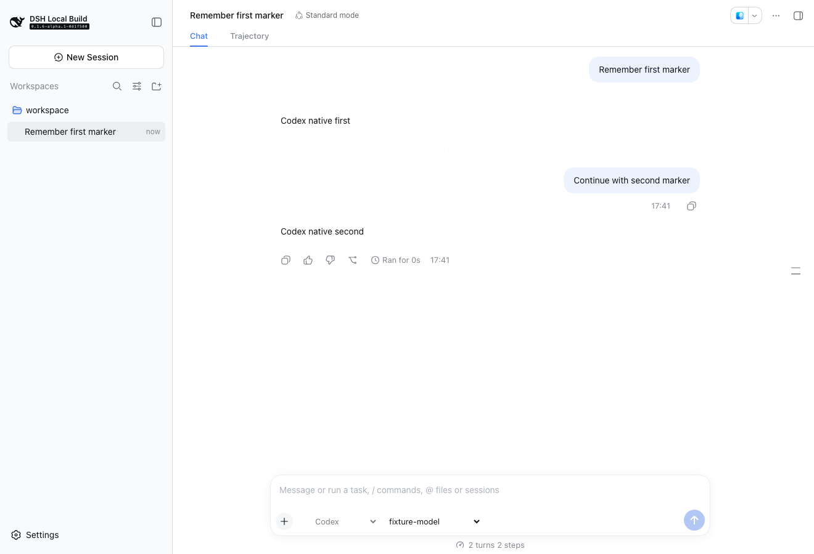

# DSH Harness Provider

将 Codex 和 Claude Code 接入 DSH 的独立插件，无需修改 DSH 源码。

插件通过 [Agent Client Protocol](https://agentclientprotocol.com)（ACP v1）连接随包提供的官方适配器：`codex-acp` 驱动本机 Codex CLI，`claude-agent-acp` 驱动本机 Claude Code CLI。对话、工具活动、提问、历史、分支和恢复都保留在 DSH 原生会话中；认证、模型推理、工具、沙箱、hooks 和权限策略仍由对应 CLI 管理。

> 当前为开发预览版，仅在 macOS 上验证。



## 功能特性

- 在 DSH 输入栏切换 DSH 原生、Codex 或 Claude Code。
- 使用 Harness 原生的模型、推理强度和权限配置。
- 流式显示回复、Claude Code 思考、命令、文件操作、网页访问、计划、提问和审批；Codex 的 reasoning summary 不展示。
- 支持图片输入、工具图片输出和本地文件附件。
- 显示上下文用量、账户额度（原生会话切换模型厂商后立即刷新；Codex / Claude Code 额度对话一轮后同步，旧值先行展示）、输出速度、token 和缓存命中。
- 支持停止、运行中追加消息、分支、回滚和异常恢复；分支在发送第一条消息前可切换到其他 Harness。
- 可手动将独立任务委派到新的 DSH 原生、Codex 或 Claude Code 会话。
- 可手动开启讨论模式，由主 Agent 按任务并发性分配一个或多个会话并汇总结论。
- Codex / Claude Code 会话不在屏幕上且空闲 1 分钟后自动关闭其原生进程（仍有后台任务时保留），下一轮对话按原生会话恢复（首条消息多几秒冷启动）。

## 前置条件

- Node.js 22 或更高版本。
- 使用 DSH 0.1.7-rc.1 的 Web Profile，本插件按该版本的消息来源、工具结果、预设注册表和实时配置接口构建与验证。
- 已安装并完成登录或环境配置的 [Codex CLI](https://developers.openai.com/codex/cli/) 或 [Claude Code CLI](https://docs.anthropic.com/en/docs/claude-code/overview)。

## 安装

将发布包加入 DSH Profile，然后启动 DSH：

```sh
dsh plugin --profile web add /absolute/path/dsh-harness-provider-0.1.9.tgz
dsh --profile web
```

外部 Harness 不需要 DeepSeek API Key。首次引导时可以选择“稍后配置”；插件会在当前会话使用外部 Harness 时跳过 DeepSeek 凭据引导。

## 快速开始

1. 新建一个空会话。
2. 在输入栏选择 **Codex** 或 **Claude Code**。
3. 按需选择模型、推理强度和权限模式。
4. 发送第一条消息。

第一条消息发送后，当前会话的 Harness 将被锁定；如需切换，请新建会话，或从消息新建分支。新会话会沿用上次选择的 Harness，以及该 Harness 最近使用且仍可用的模型和推理强度。

从消息新建的分支先沿用原会话的 Harness；在分支里发送第一条消息之前，可以在输入栏切换 Harness：

- 保持原 Harness：沿用原生会话分支，上下文完整。
- 切到 DSH 原生：直接使用分支继承的会话记录。
- 切到另一个 Codex / Claude Code：原生会话无法跨 Harness 复制，分支前的对话（用户消息、回复和工具名称，不含工具参数及输出）作为引用数据交给新会话，不进入用户消息；已回滚或编辑撤销的内容不会携带。超过“分支携带记录上限”时只保留最近部分。原会话中的工具细节和原生内部状态不会带过去，切走后再切回原 Harness 也改用这种方式。

运行中的主要行为：

- 使用 DSH 输入框继续对话，使用原停止按钮取消当前轮次。
- 运行中发送的消息会插入当前原生轮次；如果 Agent 未确认插入，本轮会取消并暂停，等待恢复。
- 图片由 DSH 校验后发送给 Harness；普通文件以本地路径提供，由 CLI 按其权限读取。
- 外部 Harness 的 `/` 菜单显示 Agent 公布的技能和本地命令。Codex 技能会在发送时由 `/name` 转为 `$name`。

### 权限模式

| Harness | 可选模式 | 默认值 |
| --- | --- | --- |
| Codex | 逐项审批、自动审批、完全权限 | 自动审批（`agent`） |
| Claude Code | 默认、接受编辑、计划、自动；符合条件时提供完全权限 | Claude 设置中的 `permissions.defaultMode` |

新会话首次绑定时，插件会将 DSH 的只读、工作区可写和完全权限映射到对应 Harness。运行期间不能切换模型、推理强度或权限模式。

### 活动映射

| Harness 活动 | DSH 显示 |
| --- | --- |
| 回复、Claude Code 思考 | 回复流、思考行；Codex reasoning summary 不展示 |
| 命令 | Bash 行 |
| 读取、搜索、编辑文件 | Read、Grep、Glob、Edit 或 Write 行 |
| 网页访问 | Web 行 |
| 计划 | 待办行 |
| 提问 | DSH 问题卡 |
| 审批 | DSH 审批卡 |
| 上下文压缩、失败说明 | 通知或说明消息 |

未识别的工具显示为通用工具行，工具输出超过 64,000 字符时会截断。密码类问题使用插件自己的保密表单，答案仅在内存中转交 Harness，不写入日志、状态文件或浏览器存储。

## 委派会话

在输入框的“指令”菜单中选择 **委派**，或输入 `/delegate`，再在原输入框中填写任务。任务可以同时携带图片和文件；发送前可多选 DSH 原生、Codex、Claude Code，并决定是否在完成后回传到当前会话。每个选中的 Harness 都会收到同一任务和附件，各创建一个独立会话；至少保留一个目标。

委派和讨论模式与正文分开保存，输入框中不插入或隐藏模式指令。删空正文仍保留模式；点击关闭按钮退出时保留正文与附件。发送期间暂时锁定输入区，失败后恢复模式和内容，成功后清空；模式内不执行当前会话的其他指令。

委派行为：

- 使用同一工作区，但拥有独立历史，并显示在 DSH 左侧会话列表中。
- 多选时，完成回传设置对所有目标生效；如果先执行 `/handoff` 等 skill，则只在来源会话执行一次，再把结果分发给所有目标。选中 DSH 原生时禁用独立 worktree。
- 只能由用户明确触发；模型无法自行创建委派会话。模型原生的 subagent 能力不受影响。
- “完成后回传”默认关闭；关闭时结果仅保留在新会话，开启时才通知并唤醒来源会话。只有创建者可以读取回传结果。
- 任何会话（包括委派创建的会话）都可由用户再次明确发起委派。
- 同 Harness 沿用来源权限；跨 Harness 使用与来源权限相匹配的目标权限。
- 发送前可为每个选中的 Codex / Claude Code 选择模型与推理强度，默认“沿用上次”。选择只作用于这次创建的会话，不改变之后新建会话沿用的模型；创建前按该 Harness 的模型目录校验，任一目标不合法时不创建任何会话。DSH 原生目标使用宿主当前模型。
- DSH 原生目标使用宿主当前的默认 Agent preset 与模型；权限取与来源沙箱级别相同的权限预设（来源为 Codex / Claude Code 时，完全权限对应完全权限，只读或计划对应只读，其余对应工作区可写），没有匹配预设时拒绝创建。
- 可选 **独立 worktree**（默认关闭，仅 Codex / Claude Code）：以来源目录当前内容（含未提交修改和未被忽略的新文件，不含 `node_modules`、`.env` 等被忽略文件）为起点，在插件数据目录下创建分离的 git worktree，Harness 在其中工作；DSH 会话仍显示在原工作区，界面中的文件与终端仍指向主目录。工作目录不是 git 仓库时拒绝创建。
- 使用 worktree 时，委派会话每轮结束且有未合并改动，会在该会话中询问：**合并并删除**（三方合并，作为未提交修改应用到主目录，不创建提交、不改动暂存区；有冲突时不应用任何改动并保留 worktree）、**放弃并删除** 或 **暂不处理**（下一轮结束时再问）。删除后该会话不再接受新的对话。

创建操作使用 `requestId` 保证幂等。开启回传后，来源 Agent 只会在收到完成通知后分页读取结果，不使用 `sleep` 或定时轮询；状态为 `not-started` 或 `interrupted` 时提醒用户进入目标会话处理，不自动重发。

## 讨论模式

在“指令”菜单中选择 **讨论**，或输入 `/discuss`，再在原输入框中填写任务并按需添加图片或文件。只有这条人工指令会授权当前主 Agent 发起一次讨论；普通对话和 `/delegate` 不会触发自动分配。

- 顶部按钮支持多选 Codex、Claude Code，至少保留一个。主 Agent 在所选范围内分配 1–4 个会话，每个选中的 Harness 至少参与一次。DSH 原生暂不支持锁定只读权限，因此显示为不可选。
- 只分配一个会话时直接执行；分配多个会话时先独立完成，再在各自原会话中互评一轮，由主 Agent 汇总最终答案。
- 参与者都是与当前会话同层显示的独立会话，共用工作区但拥有独立历史；讨论不会再递归创建新会话。
- 分配入口只在用户开启讨论的当前轮有效。相同调用重试复用已有任务，不能借此增加会话。
- 主 Agent 可按每项分工的复杂度为参与者指定模型与推理强度（先查询可用值），省略时沿用该 Harness 上次的选择；有不合法的选择时不创建任何参与者，修正后可在同一轮重试。
- 参与者锁定为只读：Codex 使用真正的只读沙箱；Claude Code 只开放读取、文件搜索和内置网页搜索/抓取工具。权限申请自动拒绝，不能切换权限、修改配置或创建会话分支；限制在恢复后继续生效。
- 原始网络与外部 MCP/应用操作不可用；内置网页能力仍受 Harness 自身支持和权限约束。无法安全拒绝或检测到权限变化时停止参与者，并在结果中报告原因；失败参与者不会自动进入互评。

## 会话恢复与数据

插件在提交每轮消息前记录“未确认”状态。进程退出或协议错误导致结果不明确时，会话会暂停；重新打开后，插件会回放原生历史并尝试确认结果：

- Codex 通过 `codex app-server` 读取原生轮次状态。
- Claude Code 根据 ACP 回放中的消息和工具状态推断结果。

无法确认时，界面会显示 **恢复会话**，可选择重新核对原生记录，或解除暂停且不重发。插件不会自动重发结果不明确的请求。

状态目录仅保存会话侧车文件和 `defaults.json`，不保存密钥或对话全文。侧车文件名使用会话 ID 的 SHA-256，权限为 `0600`。

## 配置

插件无需额外配置即可使用。默认值可在 DSH 的 **设置 → Harness**（位于“Agent 预设”下方）中修改，修改立即保存到当前 Profile 的 `cordis.patch.yml`，每项都可恢复默认；当前连接不能写入配置时页面只读。

| 分组 | 配置项 | 默认值 | 生效时机 |
| --- | --- | --- | --- |
| 会话 | `idleCloseSeconds` 空闲回收（秒） | 60 | 下一次空闲扫描 |
| 委派与讨论 | `delegateHarnesses` / `delegateReportBack` / `delegateWorktree` 委派默认目标、回传、独立 worktree | Codex / 关 / 关 | 下次进入委派模式 |
| 委派与讨论 | `discussHarnesses` 讨论默认参与者 | Codex + Claude Code | 下次进入讨论模式 |
| 进展反馈 | `progressFeedback` / `progressFeedbackText` 是否注入中文进展反馈说明及其文本 | 开 / 内置说明 | 原生进程下次启动 |
| 高级 | `requestTimeoutSeconds` / `sessionLoadTimeoutSeconds` ACP 请求、会话加载与分支超时（秒） | 60 / 120 | 下一次请求 |
| 高级 | `discussionTimeoutMinutes` 讨论等待上限（分钟） | 30 | 原生进程下次启动 |
| 高级 | `toolOutputChars` / `peerReviewChars` / `discussionResultChars` 工具输出、讨论互评摘录、讨论结果读取（字符，后者最多 64,000） | 64,000 / 12,000 / 16,000 | 下一次使用 |
| 高级 | `branchContextChars` 分支切换到其他 Harness 时携带的对话记录上限（字符，最多 120,000） | 60,000 | 原生进程下次启动 |
| 高级 | `catalogCacheSeconds` / `quotaCacheSeconds` / `pluginCacheSeconds` / `recoveryCheckSeconds` 模型目录、原生额度（最少 10）、插件目录缓存与恢复核对间隔（秒） | 60 / 60 / 30 / 30 | 下一次缓存填充 |
| 高级 | `acpStderr` 将 ACP Agent 的 stderr 输出到 DSH，仅用于排查启动问题；输出可能包含提示词或凭据（环境变量 `DSH_HARNESS_ACP_STDERR=1` 同样有效） | 关 | 原生进程下次启动 |

讨论参与者的只读权限、跨 Harness 委派的权限映射和协议上限不开放配置。以下配置项不在设置页展示，只能在 `cordis.patch.yml` 中修改：

| 配置项 | 默认值 | 说明 |
| --- | --- | --- |
| `codexCommand` | `codex` | Codex 可执行文件，也用于额度、插件和轮次记录查询；原生进程下次启动时生效 |
| `claudeCommand` | 自动查找 | Claude Code 可执行文件；未设置时使用环境变量 `CLAUDE_COMMAND_PATH`，再从 PATH、常见安装目录和版本管理器目录中查找；原生进程下次启动时生效 |
| `root` | `$DSH_HOME/harness-plugin` | 插件状态目录；未设置 `DSH_HOME` 时为 `~/.dsh/harness-plugin`；修改后插件重新加载 |

```yaml
- id: harness-plugin
  config:
    root: /absolute/path/harness-state
    codexCommand: /absolute/path/codex
```

从图形界面启动 DSH 时，插件会读取登录 shell 的环境。

## 工作原理

```text
DSH Host
└── HarnessService
    ├── DshRunner              运行、取消、插入消息和持久化状态
    ├── DshOutput              将 Harness 事件转换为 DSH 消息
    ├── DelegationBridge       创建、读取委派及受控讨论
    └── AcpAdapter
        ├── codex-acp          → 本机 Codex CLI
        └── claude-agent-acp   → 本机 Claude Code CLI
```

两个 Harness 共用同一个 ACP 适配层，差异集中在 `src/acp-profiles.ts`。插件不向 Agent 声明文件系统或终端能力，也不传入 MCP 服务器；工具始终由各 CLI 在自己的权限策略下执行。

Harness 的工具仍可并行执行，DSH 中的工具记录按启动顺序逐项登记和结算；后一项等待前一项结算后才显示，保证每项调用都有完整的日志关联，并保留冷恢复和轮次用量统计。原生模型的额度查询按提供商注册的配置行与字段路径读取当前配置，支持自定义配置行名。

## 开发

开发需要一个已构建的 `deepseek-harness` 参考仓库，默认位于 `../../deepseek-harness`。也可以通过 `DSH_REFERENCE_ROOT` 指定路径。

```sh
npm install
npm run dev:link
npm run check
```

`npm run dev:link` 会链接参考仓库中的 `@deepseek-ai/*` 包，每次运行 `npm install` 后都需要重新执行。`npm run check` 依次执行类型检查、构建和全部测试。

在 DSH `0.1.7-rc.1` 参考构建上运行 `npm run check`，覆盖工具结果、通知来源、实时额度配置、并行调用日志、取消与会话冷恢复。

其他验证命令：

| 命令 | 用途 |
| --- | --- |
| `npm run probe:acp` | 使用本机 CLI 和本地模型桩验证 ACP 目录、对话、历史、分支、技能、恢复和插入 |
| `npm pack && npm run probe:web` | 使用临时 DSH Web Profile 运行 Playwright 端到端验证 |
| `npm run probe -- <DSH 构建目录>` | 在指定 DSH 检出中验证进程内扩展点 |
| `node scripts/install-test-profile.mjs` | 打包并离线安装到隔离的测试 Profile |

贡献或修改前请阅读 [AGENTS.md](AGENTS.md)。更多实现决定和历史验证记录见 [docs/implementation-status.md](docs/implementation-status.md)。

## 已知限制

- Claude Code 的 ACP 回放不提供原生轮次结束状态，只能根据消息和工具状态推断；回复后被中断的轮次可能仍被判定为成功。
- 普通文件附件需要本地文件存储后端。
- 外部会话续聊依赖插件保持启用；DSH 更新后需要重新验证公开方法包装和客户端插槽。
- Windows、Linux 和独立 Desktop 发行包尚未验证。
- 项目级 hooks 与直接运行 CLI 一样会执行本地命令，只应在可信工作区使用。

## 许可证

本项目采用 [MIT License](LICENSE)。第三方依赖许可见 [THIRD_PARTY_NOTICES.md](THIRD_PARTY_NOTICES.md)。
