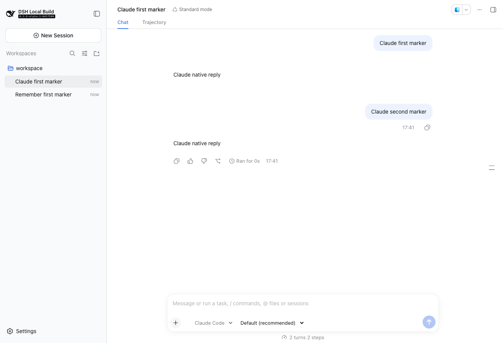

# DSH Harness 插件

独立安装到 DSH 的多 Harness 插件。首版接入 **Codex、Claude Code**，在原聊天输入栏选择 Harness，回复和历史保存在 DSH 原会话列表中。

开发预览版，验证平台为 macOS。插件不修改 DSH 源码。

## 安装与使用

先安装 Codex / Claude Code CLI，并完成所需的原生登录或环境配置。插件沿用各自的认证、模型、工作目录、工具和权限策略。

```sh
dsh plugin --profile web add /absolute/path/dsh-harness-provider-0.1.1.tgz
dsh --profile web
```

1. 连接工作目录。在空会话输入栏选择 **Codex** 或 **Claude Code**。
2. 输入栏右侧的模型胶囊可选择该 Harness 提供的模型和推理强度（Claude Code 七档、Codex 按模型提供的档位），也可保持原生默认。
3. 使用 DSH 原输入框连续发送消息，使用原停止按钮取消。发送键左侧的环形图显示 Harness 报告的上下文占用。
4. Harness 胶囊右侧的额度胶囊显示当前账户最紧张的额度窗口，点开查看全部窗口与重置时间：Claude Code 显示 5 小时、7 天和按模型的 7 天窗口；Codex 显示 ChatGPT 账户限速窗口；DSH 原生按提供方端点探测——智谱 Coding Plan（open.bigmodel.cn / api.z.ai）显示 5 小时与周额度，DeepSeek 开放平台显示账户余额，其余端点不显示。
5. 重启 DSH 后，从原会话列表打开该会话继续对话。

DSH 的首次使用引导可选择“稍后配置”；外部 Harness 不需要 DeepSeek API Key。已选外部 Harness 时，插件跳过 DeepSeek 凭据引导，用 Harness 自己的权限模式与模型控件替换 DSH 原生的权限、模型控件，并隐藏计划控件。Claude Code 的权限胶囊可切换计划/默认/接受编辑/自动/完全权限；Codex 的权限胶囊可切换只读/工作区可写/完全权限（对应 Codex 的沙箱模式与审批策略），默认取自 `~/.codex/config.toml` 的 `sandbox_mode`。切换 Harness 时，权限按 DSH 原生沙箱模式映射（原生完全权限对应 Claude Code 的完全权限与 Codex 的完全权限）；新会话自动沿用上次选择的 Harness，以及该 Harness 上次选择的模型与推理强度。额度胶囊与上下文环形图按剩余量显示，余量低于 30% 转为琥珀色，低于 10% 转为红色。

Harness 在第一条消息后固定；需要换 Harness 时新建会话。不同会话可分别使用 DSH、Codex、Claude Code。

### 配置

默认配置即可使用。需要指定 Codex 可执行文件或插件状态目录时，在 Profile 的 `cordis.patch.yml` 添加：

```yaml
- id: harness-plugin
  config:
    codexCommand: /absolute/path/codex
    root: /absolute/path/harness-state
```

Claude Code 可执行文件可用 `CODEXHOST_CLAUDE_COMMAND` 环境变量指定；这是复用 Adapter 已有的配置项。

默认状态目录为 `$DSH_HOME/harness-plugin`；未设置 `DSH_HOME` 时为 `~/.dsh/harness-plugin`。其中只保存 DSH 会话 ID、Harness、原生会话引用、模型和未确认请求标记，不保存密钥或额外的全文历史。

## 支持范围

- 文本多轮对话、流式文本及推理摘要。
- DSH 原会话列表、历史浏览、正常关闭后的原生会话恢复。
- 排队发送、取消、原生工具活动展示。
- 通过 DSH 原问答界面转交 Harness 审批和普通问题；仅转发明确有效的答复。
- 原生会话始终由对应 Harness 维护；DSH 日志是界面投影，不作为拼接历史重新创建原生对话。

### 当前边界

- 暂不支持附件输入、图片工具结果导入、插入正在运行的一轮、会话分支、回滚。服务会拒绝不支持的操作。
- DSH 通用问答框没有密码输入契约，因此包含保密输入的问题会停止该请求。
- 断连或记录失败导致请求结果无法确认时，插件停止原生执行并暂停该会话发送，避免自动重发产生重复操作；当前没有自动对账或手动恢复界面。
- Claude Code 未报告的 Provider 不作猜测，DSH 消息来源记为 `unreported`。
- 外部会话续聊需要保持插件启用。插件卸载会恢复其包装的公开方法与覆盖的界面插槽。
- 支持本文列出的 DSH 版本；公开服务方法包装与客户端插槽需要随 DSH 更新重新验证。Windows、Linux 和独立 Desktop 发行包尚未验证。

## 实现入口

- `src/dsh.ts`：插件服务、严格校验的 Remote 接口、原会话命令接入及卸载恢复。
- `src/dsh-runner.ts`：通过公开 `agent/pre-step` 接收外部会话输入，协调原生运行、取消和状态持久化。
- `src/dsh-output.ts`：映射到 DSH 已有消息、工具、通知与流式事件；不新增持久化事件类型。
- `src/client.tsx`：原输入栏选择器、模型目录及条件插槽覆盖。
- `src/codex-adapter.ts`、`src/codex-rpc.ts`：Codex 原生 app-server 持久会话与进程生命周期。
- Claude Code 复用 codexhost 的独立 Adapter 构建产物，随插件打包。

## 开发

需要已构建的参考项目 `codex-host` 与 `deepseek-harness`（默认位于上两级目录 `../../`），或用 `DSH_REFERENCE_ROOT` / `CODEXHOST_REFERENCE_ROOT` 指定：

```sh
npm run dev:link
npm run check
node experiments/codex-native-probe.mjs
node experiments/claude-native-probe.mjs
npm pack --ignore-scripts
node experiments/dsh-web-probe.mjs
```

开发链接只写本插件的 `node_modules`。构建产物不依赖 codexhost 工作区。Web 验证通过官方 `dsh plugin` 安装临时 Profile，使用真实 CLI、本地模拟模型服务和 Chromium；结束后清理临时状态，不使用真实模型端点。

## 验证记录

2026-09-15：

- DSH `0.1.6-alpha.1`，既有本地构建标识 `0.1.6-alpha.1-0d1f500`。
- Codex CLI `0.144.6`；Claude Code CLI `2.1.272`。
- Host / Client 分开进行 TypeScript 严格检查，构建通过。
- 7 项自动化检查覆盖请求匹配、原生会话身份、审批响应、进程树关闭、公开命令包装/卸载、DSH 日志与流式事件、运行中及初始化时取消、冷恢复和失败停止。
- 两个真实 CLI 均通过多轮、原生身份保存和跨进程恢复验证；模型服务为本地测试服务。
- Web 安装与浏览器：Codex、Claude Code 均通过原输入框两轮对话，以及重启 DSH 后从原会话列表打开并继续第三轮。
- 一次与原生 CLI 检查并行运行的 Web 复验中，Codex 模型目录查询进程退出，界面显示错误与重试按钮；随后单独运行完整 Web 复验通过。该次进程退出原因尚未确认。

未执行真实云模型、真实写文件审批、Windows/Linux 和独立 Desktop 产品验证。

## 验证截图

本地模拟模型回复，用于验证真实 CLI 与 DSH 界面链路：



